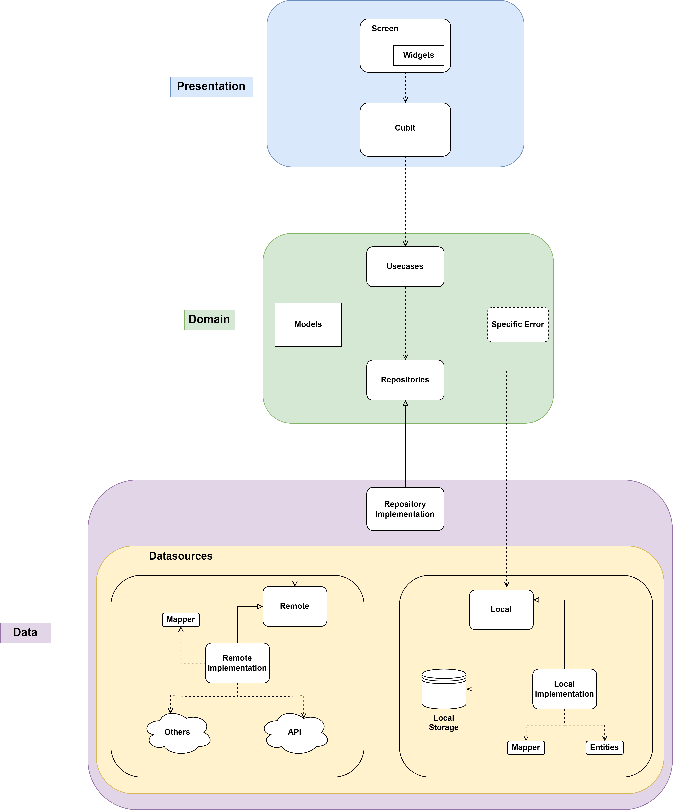

# Project Architecture

This project develop using one of the best architecture pattern, named as **Clean Architecture**.

## Clean Architecture

Clean architecture is the blueprint for a modular system, which strictly follows the design principle called separation of concerns.
The main idea of this architecture is **dividing architecture structure into some layers**. Each layer is independent and represent their respective area. So the application can be more readable, testable and maintenable.

This Architecture has to implement these principles/practices:

- **Do one thing**: A function should do just one thing and do it well.
- **Single Responsibility Principle**: A given method/class/component should have a single reason to change.
- **Dependency Injection**: As much as possible, class dependency should be provided by objects outside of the class.
- **Code Architecture**: i.e Clean Architecture.

Below is the concept of clean architecture that is implemented in this application:

There are three main layer:

### 1. Presentation layer

Presentation layer is the layer that interact with user, it contains the UI and Controller (cubit) that handle state management for the screen.

- **Screen**: these are simply the screen of feature
- **State Management/Controller**: these are cubit that handle the changes of UI
- **Widgets**: Any other specific widgets needed by its screen.

### 2. Domain Layer

Domain Layer is the **innermost** part of the layers (no dependencies with other layers). This layer should only be concerned with the business logic of the application, not with the implementation details. Therefore, it the most abstract layer in the architecture.

- **Usecases** 
  - Application-specific business rules
  - Encapsulate all the usecases of the application
  - Orchestrate the flow of data throughout the app
  - Should not be affected by any UI changes whatsoever
  - Might change if the functionality and flow of application change
- **Models**
  - Enterprise-wide business rules
  - Made up of classes that can contain methods
  - Business objects of the application
  - Used application-wide
  - Least likely to change when something in the application changes
- **Repositories**
  - Abstract classes that define the expected functionality of outer layers
  - Are not aware of outer layers, simply define expected functionality
    - E.g. The Login usecase expects a Repository that has login functionality
  - Passed to Usecases from outer layers

- **Specific Error**: simply a specific error for specific case.

### 3. Data Layer

Data layer is a part of the outermost layer that responsible for data retrieval and repository implementation.

- **Datasources**
  Consist of remote and local Data Sources.

  - **Remote**: Abstract class that define functions to retrive data from remote (API, Firebase, etc).
  - **Local** : Abstract class that define function to retrieve data from local storage.
  - **Remote/Local Implementation**: Actual implementation of the remote/local abstraction. It will perform Http request on the API or store/get data from local storage.
  - **Mapper**: Map json object that retrieve from datasource implementation to be Model which will be used in implementation.

- **Repositories implementation**
  - Actual implementations of the repositories in the Domain layer.
  - Every Repository should implement Repository from the Domain layer
  - Using polymorphism, these repositories from the data layer can be passed across the boundaries of layers
  - Responsible to coordinate data from the different Data Sources.
