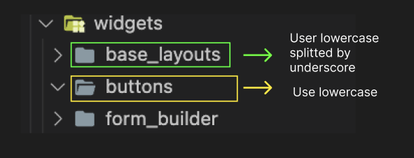
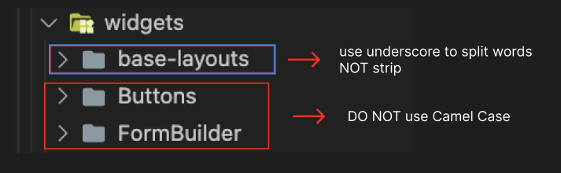

## Folder

---

- **DO** name folder with `snake_case` (`lowercase_with_underscores`).
  **`GOOD`**
  

  **`BAD`**
  

---

- **DO** name sub-modules without parent prefix name
  **`GOOD`**

  ```
  📦timesheet
  ┣ 📂create
  ┣ 📂detail
  ┣ 📂history
  ┗ 📂update
  ```

  **`BAD`**

  ```
  📦timesheet
  ┣ 📂timesheet_create
  ┣ 📂timesheet_detail
  ┣ 📂timesheet_history
  ┗ 📂timesheet_update
  ```

---

- **DO** name folder with plural or singular form
  - If the contents of a folder are grouped because they have similarities, then the folder is named using the plural form.
  - If the contents of a folder are grouped because they are parts of the folder, then the folder is named using the singular form
    

## File

---

- By default, **DO** name folder with `snake_case` (`lowercase_with_underscores`).

  | File type                 | Rules                                     | Example                                                          |
  | ------------------------- | ----------------------------------------- | ---------------------------------------------------------------- |
  | widgets                   | `widget_name`                             | `loading_circular`, `avatar_profile`                             |
  | screen                    | `screen_name_`+ `screen`                  | `department_screen.dart`, `profile_screen.dart`                  |
  | cubit                     | `cubit_name_`+ `cubit`                    | `department_list_cubit.dart`, `profile_detail_cubit.dart`        |
  | state                     | `cubit_name_`+ `state`                    | `department_list_state.dart`, `profile_detail_state.dart`        |
  | usecase                   | `usecase_name`                            | `get_department_list.dart`, `get_profile_detail.dart`            |
  | repository                | `repository_name_`+ `repo`                | `department_repo.dart`, `profile_repo.dart`                      |
  | model                     | `model_name_`+`model`                     | `department_model.dart`, `profile_model.dart`                    |
  | remote datasource         | `datasource_name` + `network_dts`         | `department_network_dts.dart`, `user_profile_network_dts.dart`   |
  | local datasource          | `datasource_name` + `local_dts`           | `department_local_dts.dart`, `user_profile_local_dts.dart`       |
  | repository implementation | `repo_name` + `repo_impl`                 | `department_repo_impl.dart`, `profile_repo_impl.dart`            |
  | mapper                    | `mapped_model_name` + `source` + `mapper` | `department_network_mapper.dart`, `department_local_mapper.dart` |
