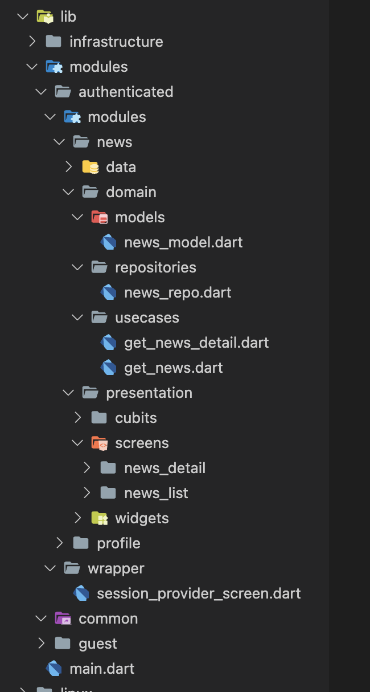
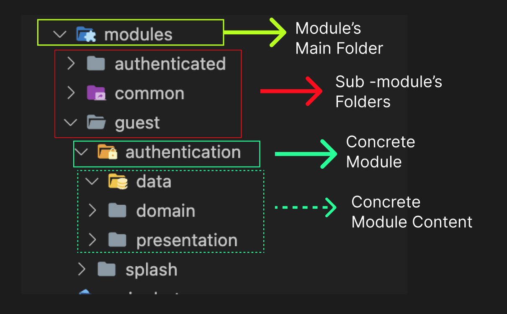
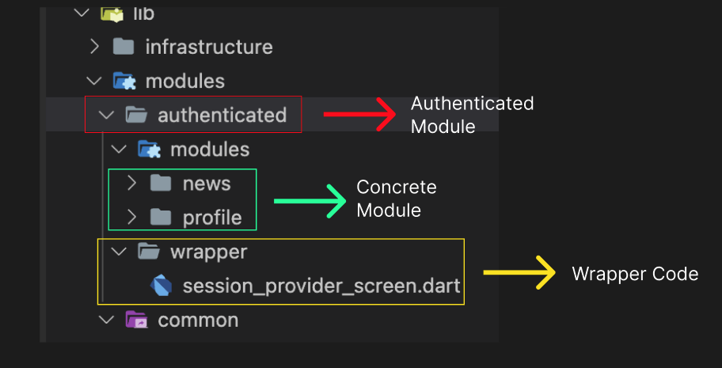
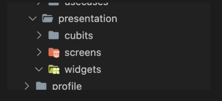
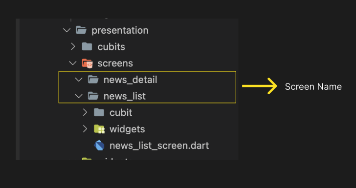

# Folder Structure

This is a folder structuring guide of **JC-Rukun**. This folder structuring is based on the Architecture of the App.


## Full Project Structure
-----
In this section, you will see the whole folder structure of the app. Each folder in the structure will be explained in the next section.




## Folder Definitions
------

**Infrasturcure**

```
 ┣ Infrastructure
 ┃ ┣ 📂 http_client
 ┃ ┣ 📂 base_widgets
 ┃ ┃ ┃ ┣ 📂 layout
 ┃ ┃ ┃ ┃  ┗ 📜base_dialog.dart
 ┃ ┃ ┃ ┣ 📂 button
 ┃ ┃ ┃ ┃  ┗ 📜primary_button.dart
 ```

    Infrastructure folder will contain reusable codes that will help the development process. All code in the infrastructure can be used within the whole project 

    Do :
    - Put Reusable code that has no business related logic  here
    - It is recommended to grouped the code into another sub folder if it has some similarities. (Look at the example)

    Don't:
    - Don't put any busineess related code to here.
    


### **Modules**



`Module's Main Folder`  contain all business relalated code. The module's folder may contains `Concrete Module` or another `Sub-Module`.



Every `Sub-Module's Folders` may have a wrapper folder that contains a code that will be used only on the related sub-module. In the example above, we have an **authenticated sub module** where it has a wrapper code (session_provider_screen), that will provide a `session` to the whole authenticated sub-modules.

Every `Concrete Module` has 3 main layer `data`, `domain`, and `presentation`. Each layer is an implementation of the architecture that is used by the project. The definition from the architecture point of view can be read in the [Architecture Documentation](). This documentation  will only explain `data`, `domain` and `presentation` layer from folder structure point of view.


### **Presentation Layer**
-----


Presentation layer will have 3 sub folder. Like the image above, there are `cubits folders` , `screen folders`, and `widgets` folder.

```
cubits Folder will contain cubits that is reusable within the `Concrete Module` scope
```

```
widgets Folder will contain widgets that is reusable within the `Concrete Module` scope
```



Screen folder will contain bunch of screens related to the `Concrete Module`. The screen also has a `cubits` and `widgets` folder. 

The `cubits` folder inside the screen folder will contain one or more cubits that only used by the screen. 

The `widgets` folder inside the screen folder will contain one or more widgets that only used by the screen. 


```
The Domain layer and Data layer definition can be seen in the architecture documentation
```
