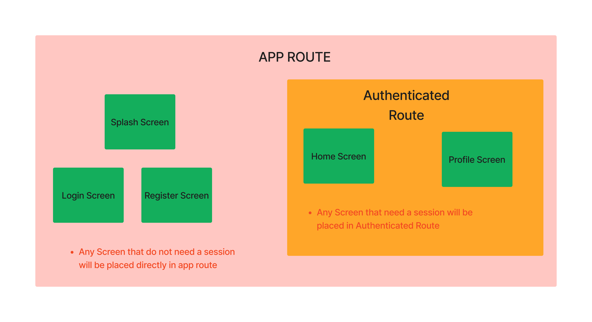
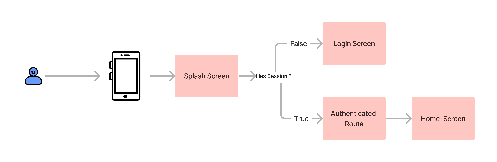
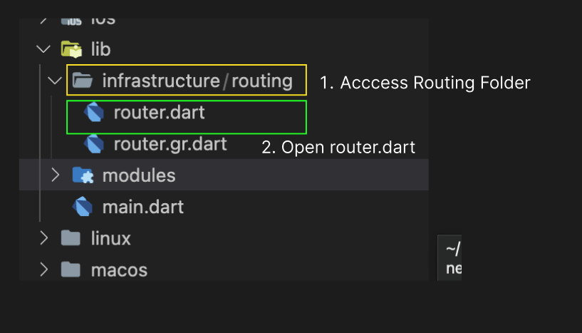
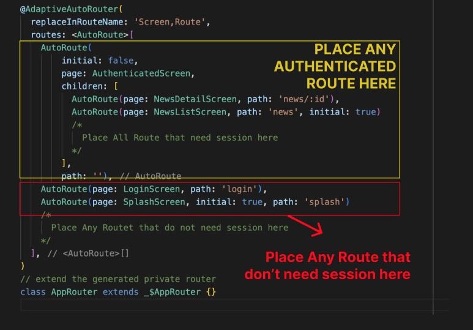

# Routing

## Routing Structure



- All Screen will be placed under `APP ROUTE`(Application Route).
- Any Screen that do not need any session will be placed directly inside `APP ROUTE`
- Any Screen that need a session to work will be placed insied `Authenticated Route`. This `Authenticated Route` will also provide a session to every single screen inside its route.


## Routing Flow



```
  - User Access App
  - App Show Splash Screen and Checking Last Session Status
    - IF user HAS SESSION
        - Redirect To any initial Page in Authenticated ROUTE 
    - IF user HAS NO SESSION
        - Redirect To Login Screen 
```


## How To Add Route


1. Access `routing` Folder Inside `infrastructure` Folder
2. Open `router.dart`


3. Place the screen you want to input. 
- If the screen is only for authenticated user you **must** register the screen inside the authenticated route
- If the screen is a route that can be accessed by the unauthenticated user, you **must** register the screen inside the app route.


 


